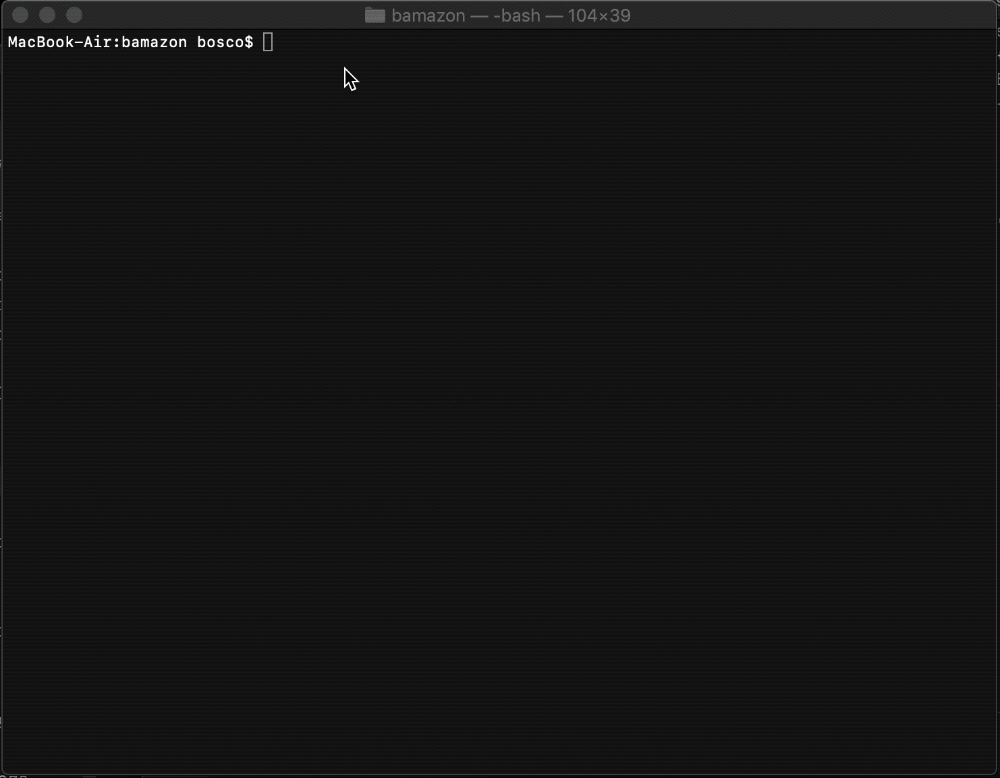

# WELCOME TO BAMAZON

This application allows you to interact with mySQL database. 

The database contains information on available items to buy. 

### how it works 

the application is a CLI that uses node to view items available. User can enter the id of items they want to buy as well as the quantity they want. 

If there is enough items in stock, the application logs all details about the product being bought, price to pay and remaining stock. 

The application also updates the database to reflect the change in stock quantity after a successful purchase. 

### technology used 

The application is a command line interface written in Javascript, node.JS, and MySQL. 

Please refer to this demo gif to see how the application works:

